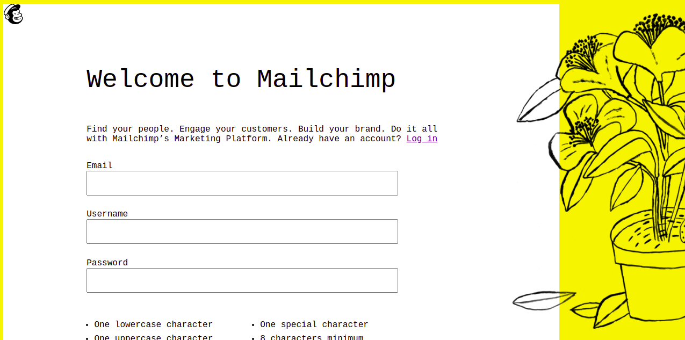

# Mailchimp-clone
<ul>
<li>In this project I'm trying to make an almost copy of <a href="https://login.mailchimp.com/signup/"> Mailchimp login page</a> </li>
<li>It's a part of The Odin Project. The link to the assignment is here : https://www.theodinproject.com/courses/html-and-css/lessons/html-forms </li>
<li>The idea was to learn to use forms </li>
<li>According to the assignment, no Javascript is used in this project. Only HTML/CSS.</li>
<li>I'm quite happy with the outcome, I learned how to crop png images as I wish</li>
<li> SS of my copy of the Mailchimp login page 
</ul>
